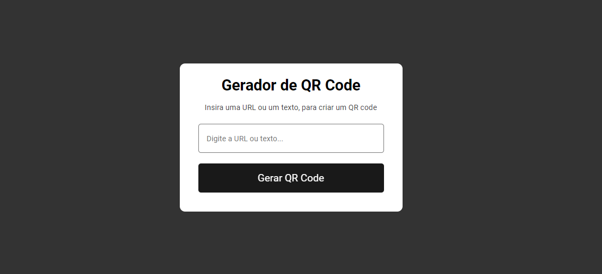

QR Code Generator
Este é um projeto simples de gerador de QR Code desenvolvido com HTML, CSS e JavaScript. A aplicação permite que o usuário insira um texto ou URL e, com um clique, gere o QR Code correspondente utilizando uma API.

🚀 Funcionalidades
Geração de QR Code a partir de texto ou URL 
Interface intuitiva e fácil de usar 
Responsividade para diferentes tamanhos de tela 
🛠️ Tecnologias Utilizadas 
HTML5: Estruturação do conteúdo da página 
CSS3: Estilização da interface com design simples e responsivo 
JavaScript: Manipulação de dados e integração com a API para gerar o QR Code 
API de QR Code: Geração dinâmica de QR Codes 

🔗 Demonstração
Você pode testar a aplicação diretamente através deste link:
<a href="https://joaovictorlira.github.io/joaolira.github.io/">Teste aqui!<a/>

🔧 Instalação

1 - Clone este repositório:

git clone https://github.com/joaolira-dev/qrcode-generator.git

2 - Navegue até a pasta do projeto

cd qr-code-generator

3 -  Abra o arquivo index.html no seu computador

📋 Como Usar
1 - Insira o texto ou a URL que deseja converter em QR Code. 
2 - Clique no botão "Gerar QR Code". 
3 - O QR Code será exibido na tela.  

